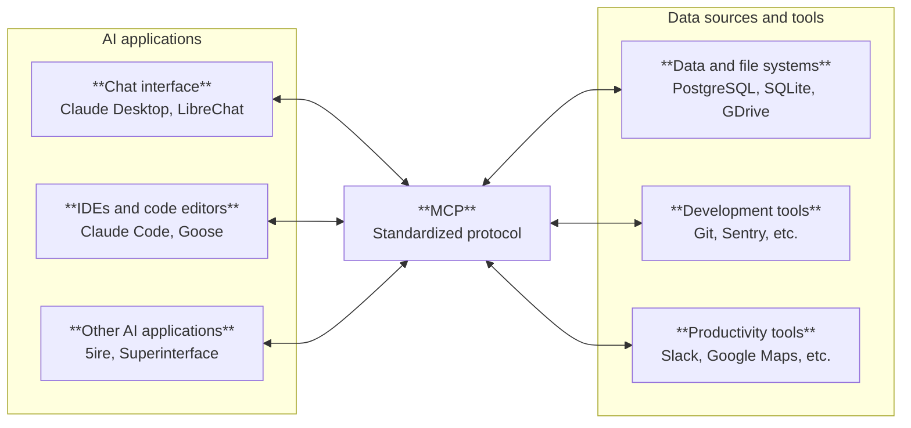
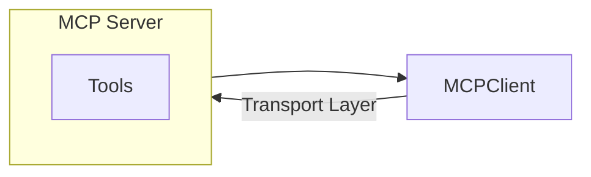
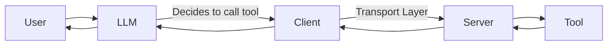

# MCP - Model Context Protocol

---
> Learn how to build and connect **MCP servers and clients** using FastMCP.
> No prior MCP knowledge required — basic Python is enough.
---

## 1️⃣ Introduction

### What Problem Does MCP Solve?

Large Language Models (LLMs) are powerful at reasoning and generating text.

But alone, they **cannot interact with your systems**.

They cannot:

* Read local files
* Query databases
* Call APIs
* Execute shell commands
* Access real-time data
---
## What is MCP?
**Model Context Protocol (MCP)** provides a standard way for LLMs to call external tools safely and reliably. Instead of hard-coding every integration, you define tools once; any MCP-compatible client can use them.

## Tool Calling

Without tools, an LLM can only:
- Answer from its training data
- Hallucinate about real-world state

With tools, an LLM can:
- Get up-to-date information
- Take actions on your behalf
- Integrate with your systems safely and consistently

### Why Tool Calling Matters

| Without Tools                 | With MCP                |
| ----------------------------- | ----------------------- |
| Uses only training data       | Accesses real-time data |
| May hallucinate state         | Executes real actions   |
| No infrastructure integration | Integrates safely       |

### Real-World Use Cases

| Use Case        | Tools Might Include                    |
|-----------------|----------------------------------------|
| Code assistant  | File read, search, lint, run tests     |
| Data analysis   | SQL query, CSV load, chart generation  |
| DevOps          | Deploy, logs, metrics, alerts          |
| Personal agent  | Calendar, email, reminders, notes      |

---
### MCP Ecosystem Overview

> Reference: [modelcontextprotocol.io](https://modelcontextprotocol.io/docs/getting-started/intro)

---

### Simple Architecture

MCP has two main pieces that communicate over a transport layer:

- **MCP Server** – Hosts tools, etc. Runs as a process and responds to client requests.
- **MCP Client** – Connects to the server and forwards requests from the model (e.g. Claude Desktop, Cursor, or a custom app).
- **Transport** – How the client and server communicate (stdio or HTTP). MCP defines the message format; transport is the carrier.
---

## The Basic Flow

1. The **user** asks a question.
2. The **model** decides it needs a tool (e.g., "add two numbers").
3. The model calls the **tool** via the MCP client.
4. The **MCP server** runs the tool and returns the result.
5. The model receives the result, reasons, and responds to the user.

---

---

### What Each Component Does

| Component | Role |
|---|---|
| **LLM** | Reasons about user input, decides when to call tools, interprets results |
| **MCP Client** | Talks to the LLM, sends tool calls to the server, returns results |
| **MCP Server** | Runs your tools, serves resources, manages prompts |
| **Tools** | Your Python functions exposed with names and schemas |

---

## Reference
> FastMCP provides both server and client. See [gofastmcp.com](https://gofastmcp.com).

---

**Next:** [02 – MCP Core Concepts](02-core-concepts.md)