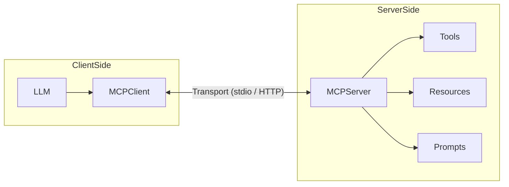
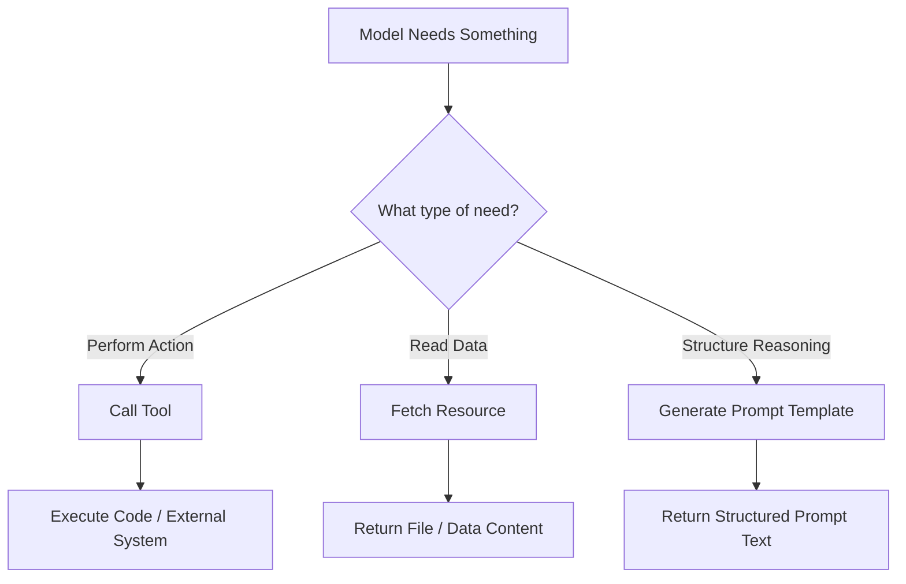

# 2️⃣ MCP Core Concepts

## Simple Architecture


---
### What Each Component Does

| Component | Role |
|---|---|
| **LLM** | Reasons about user input, decides when to call tools, interprets results |
| **MCP Client** | Talks to the LLM, sends tool calls to the server, returns results |
| **MCP Server** | Runs your tools, serves resources, manages prompts |
| **Tools** | Your Python functions exposed with names and schemas |
| **Resources** | Read-only content the model can fetch by URI |
| **Prompts** | Templates that shape the model's behavior |

---

## Main Components

### 🛠 Tool

A **Tool** in MCP is a callable capability that the model can invoke to perform real work.

It is not just a Python function.

When exposed through MCP, a tool includes:

* A **name**
* A **description**
* A **typed parameter schema**
* A **return value**
* (Optionally) access to external systems

The model reads the name, description, and parameter types to decide:

* Whether it should call the tool
* When to call it
* What arguments to provide

---

#### Mental Model

Think of a Tool as:

> An API endpoint that the LLM can call autonomously.

It allows the model to move from:

* “Thinking”
  to
* “Doing”

---

#### Simple Example

```python
def add(a: int, b: int) -> int:
    return a + b
```

This becomes an MCP tool when registered on the server.

The model sees something like:

* **Name:** `add`
* **Description:** Add two integers
* **Parameters:**

  * `a` (integer)
  * `b` (integer)

If the user asks:

> What is 4 + 5?

The model may generate:

```json
{
  "name": "add",
  "arguments": { "a": 4, "b": 5 }
}
```

The MCP server executes the function and returns:

```
9
```

The model then uses that result to answer the user.

---

#### Real-World Example (More Practical)

A tool can also access external systems:

```python
def get_weather(city: str) -> dict:
    # Calls weather API
    ...
```

Now the model can:

* Fetch real-time weather
* Query databases
* Interact with Slurm
* Deploy containers
* Read logs

---

#### Tool Characteristics

| Property                | Description                   |
| ----------------------- | ----------------------------- |
| Executable              | Runs real code                |
| Parameterized           | Accepts structured inputs     |
| Deterministic (usually) | Returns computed result       |
| Can cause side effects  | May modify system state       |
| Server-side             | Runs inside MCP server |

---

#### Important Insight

Without tools, the model can only **simulate knowledge**.

With tools, the model can **interact with reality**.

That is the core power of MCP.

---


### 📄 Resource

A **Resource** in MCP is read-only content that the model can fetch using a URI.

It does not execute code.
It does not change anything.
It simply provides data.

Think of it as:

> A file or document the model is allowed to read.

---

#### What Makes a Resource Different?

* No execution
* No side effects
* Just returns content
* Safe by design

---

#### Simple Example

Imagine you have a file:

```
/home/user/notes.txt
```

Its content:

```
Meeting at 10am.
Buy milk.
Finish MCP assignment.
```

The client exposes this directory as a root.

The model can request:

```
file:///home/user/notes.txt
```

The server returns:

```
Meeting at 10am.
Buy milk.
Finish MCP assignment.
```

The model can now use that content to answer questions.

---

#### Scenario

User asks:

> What tasks do I have today?

The model does not know.

So it fetches the resource:

```
file:///home/user/notes.txt
```

After reading the file, it answers:

> You need to buy milk and finish the MCP assignment.

---

#### Resource Characteristics

| Property         | Description                             |
| ---------------- | --------------------------------------- |
| Read-only        | Cannot modify data                      |
| URI-based        | Accessed via `file://` or other schemes |
| No execution     | Does not run code                       |
| Context provider | Supplies information to the model       |
| Server-hosted    | Managed by the MCP server               |

---

#### Tool vs Resource (Simple Reminder)

* **Tool → Do something**
* **Resource → Read something**

If you need to:

* Calculate → Tool
* Call API → Tool
* Read a file → Resource
* Get document content → Resource


---


### 🧠 Prompt

Predefined template shaping model behavior.

A **Prompt in MCP** is a reusable template hosted on the server.

It is not just a sentence.
It can:

* Accept parameters
* Inject structured context
* Standardize model behavior
* Be reused across clients

Think of it like:

> A function that returns a structured prompt for the LLM.

---

#### Why Prompts Exist in MCP

Instead of hardcoding behavior in every client, you define it once on the server.

Example use cases:

* Code review assistant
* SQL explanation template
* Security analysis format
* HPC job analysis template
* Incident report formatter

---

#### Example

Imagine you want a **Code Review Prompt**.

The MCP server defines:

```python
@mcp.prompt()
def code_review(language: str, code: str) -> str:
    return f"""
You are a senior {language} engineer.

Review the following code:
{code}

Provide:
1. Bugs
2. Performance issues
3. Security risks
4. Suggested improvements
"""
```

Now the client can request:

```json
{
  "name": "code_review",
  "arguments": {
    "language": "Python",
    "code": "def add(a,b): return a+b"
  }
}
```

The server returns the fully constructed prompt text.

The LLM then uses that prompt to generate the structured review.

#### Important Insight

Many beginners confuse:

> “Prompt = tool that returns text”

This is wrong.

A **Tool returns data from execution.**
A **Prompt returns instructions for reasoning.**

They operate at completely different abstraction layers.
---

### 🔎 Tool vs Prompt vs Resource

These three are fundamentally different capabilities in MCP.

| Dimension                                       | Tool                       | Resource               | Prompt                   |
| ----------------------------------------------- | -------------------------- | ---------------------- | ------------------------ |
| Primary Purpose                                 | Perform an action          | Provide read-only data | Shape model reasoning    |
| Executes code                                   | ✅ Yes                      | ❌ No                   | ❌ No                     |
| Access external systems (DB, APIs, Slurm, etc.) | ✅ Yes                      | ❌ No                   | ❌ No                     |
| Returns structured data                         | ✅ Yes                      | ⚠️ Usually raw content | ❌ Returns formatted text |
| Changes system state                            | ✅ Possible                 | ❌ Never                | ❌ Never                  |
| Accepts parameters                              | ✅ Yes                      | ⚠️ Via URI             | ✅ Yes                    |
| Reusable template                               | ⚠️ Sometimes               | ❌ Not really           | ✅ Yes                    |
| Security impact                                 | High (can execute actions) | Medium (data exposure) | Low                      |

---

## Mental Model

* **Tool → Do something**
* **Resource → Read something**
* **Prompt → Think in a structured way**

---

## Decision Flow (All Three Included)



---

#### When To Use What?

| If you need to…                              | Use      |
| -------------------------------------------- | -------- |
| Call an API                                  | Tool     |
| Query a database                             | Tool     |
| Read a file                                  | Resource |
| Standardize how the model analyzes something | Prompt   |
| Enforce structured output style              | Prompt   |
| Perform side effects                         | Tool     |

---

#### Practical Example Comparison (Student-Friendly)

Let’s use a simple scenario:

You are building a small **study assistant**.

A student asks:

> “What is my total score?”
> “What homework do I have?”
> “Summarize my notes.”

Now let’s see how Tool, Resource, and Prompt are different.

---

#### 🛠 Tool Example

```python
def calculate_total_score(math: int, physics: int) -> int:
    return math + physics
```

What it does:

* Performs a calculation
* Executes code
* Returns computed result
* Could modify something (in other cases)

If the user asks:

> What is my total score if I got 80 in math and 90 in physics?

The model calls:

```json
{
  "name": "calculate_total_score",
  "arguments": { "math": 80, "physics": 90 }
}
```

The server returns:

```
170
```

Tool = **Does something**

---

#### 📄 Resource Example

Imagine you have a file:

```
file:///home/student/homework.txt
```

Content:

```
- Math: Exercise 5
- Physics: Chapter 3 summary
- English: Essay draft
```

If the user asks:

> What homework do I have?

The model fetches the resource:

```
file:///home/student/homework.txt
```

The server returns the file content.

The model reads it and answers.

Resource = **Reads something**

---

#### 🧠 Prompt Example

Now imagine you want the model to always summarize notes in a structured way.

You define a prompt:

```python
def summarize_notes(notes: str) -> str:
    return f"""
You are a helpful study assistant.

Summarize the following notes in:
1. Key concepts
2. Important dates
3. Definitions
4. Short explanation

Notes:
{notes}
"""
```

When the user says:

> Summarize my biology notes.

The model gets a structured template and produces consistent output.

Prompt = **Shapes how the model thinks**

---

# 🔍 Side-by-Side Comparison

| If you need to…                | Use      |
| ------------------------------ | -------- |
| Add numbers                    | Tool     |
| Read homework list             | Resource |
| Format a summary nicely        | Prompt   |
| Call an external API           | Tool     |
| Load a document                | Resource |
| Enforce structured explanation | Prompt   |

---

# 🧩 The Big Difference

* Tool → Executes logic
* Resource → Provides data
* Prompt → Guides reasoning

They solve **three different problems**.

---

**Next:** [03 – Architecture and Flow](03-architecture.md)